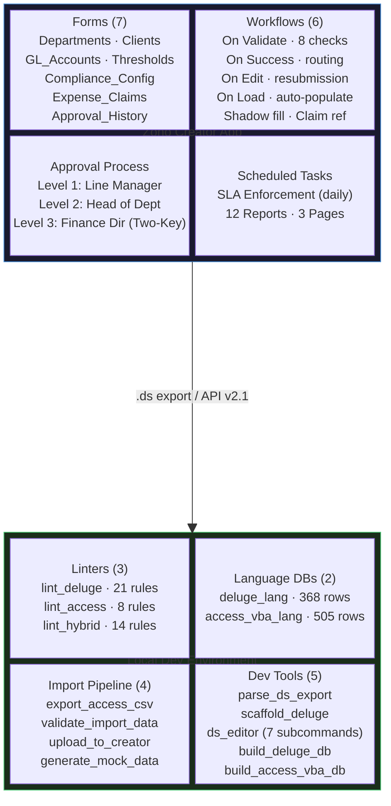
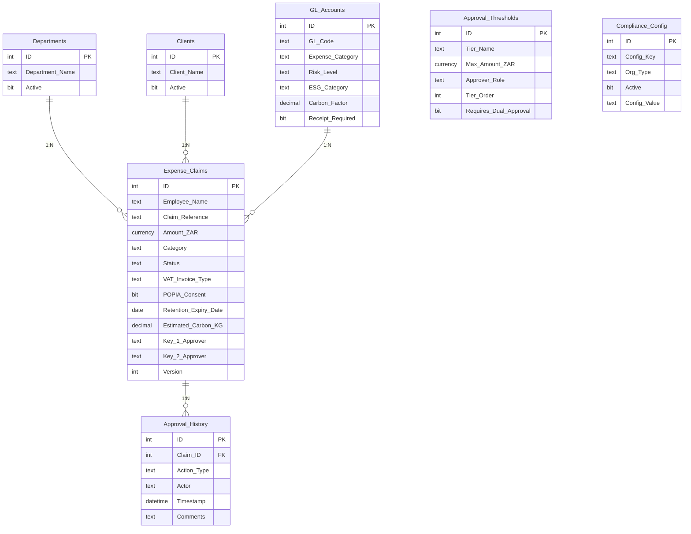
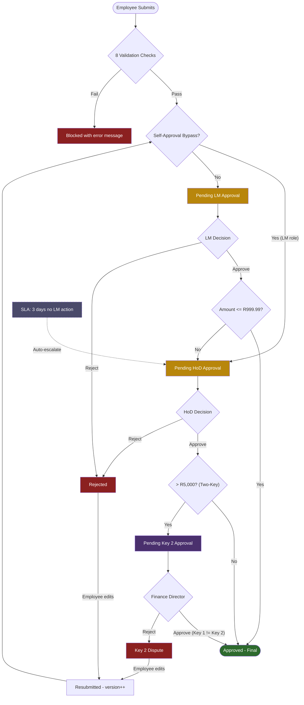

# Expense Reimbursement Manager

A governance-first expense reimbursement system built on **Zoho Creator** with a **code-first development workflow** -- edit locally, lint, deploy via `.ds` import. South African compliance (King IV, SARS, COSO) drives every architectural decision. Built for the Both& practical assessment.

## What Makes This Different

Zoho Creator has no deployment API. The conventional approach is manual: click through the UI, paste scripts, hope nothing breaks. This repo takes a different path:

1. **Edit `.dg` scripts and `.ds` exports in Git** -- version-controlled, reviewable, diffable
2. **Lint before deploy** -- 43 static analysis rules across 3 linters catch errors before they reach Creator
3. **Import the `.ds` file** -- Creator accepts structural, permission, AND script changes
4. **Re-export and diff** -- verify what Creator actually applied
5. **Log discoveries** -- runtime errors feed back into the linter so they never happen twice
6. **Cross-environment validation** -- hybrid linter validates Access-to-Zoho field mappings, type conversions, and Deluge script coverage

The Python tooling (13 tools, 8,197 LOC) now dwarfs the Deluge scripts it validates (13 scripts, 693 LOC). The tooling layer is being extracted into **ForgeDS** -- a reusable engine for any Zoho Creator project.

This repo is the version archive, documentation hub, deployment source, AND development environment.

## Table of Contents

- [Project Status](#project-status)
- [What's Next](#whats-next)
- [Governance Framework](#governance-framework)
- [Architecture](#architecture)
- [Repository Structure](#repository-structure)
- [Development Workflow](#development-workflow)
- [Tooling](#tooling)
- [Access-to-Zoho Import Pipeline](#access-to-zoho-import-pipeline)
- [Deluge Scripts](#deluge-scripts)
- [Data Model](#data-model)
- [Approval Flow](#approval-flow)
- [Mock Data & Stress Testing](#mock-data--stress-testing)
- [ForgeDS: Extracting the Engine](#forgeds-extracting-the-engine)
- [Governance Gap Remediation](#governance-gap-remediation)
- [Discovery Log](#discovery-log)
- [Getting Started](#getting-started)
- [Key Documents](#key-documents)
- [Metrics](#metrics)
- [License](#license)

## Project Status

**Current version: v0.7.0** (International Standards Alignment + ESG Tracking)

| Phase | Description | Status |
|-------|-------------|--------|
| 1-2 | Forms, lookups, seed data | Complete |
| 3 | Approval process (LM + HoD) | Complete |
| 4 | Reports + conditional formatting | Complete |
| 5 | Dashboards (Employee + Management) | Complete |
| 6 | Governance gap remediation (15/16 gaps) | Complete |
| 7 | Access-to-Zoho import tooling + hybrid linter | Complete |
| 8 | Mock data generation (7 personas, 175 claims) | Complete |
| 9 | Two-Key threshold authorization (3-tier dual-approval) | Complete |
| 10 | International standards alignment + ESG tracking | Complete |
| 11 | Custom API research + ForgeDS extraction planning | Complete |
| 12 | Live API integration + stress testing | Next |

15 of 16 governance gaps resolved. 1 remaining (G-05: hardcoded email addresses -- requires config table design decision).

## What's Next

### Near-Term: Live API Integration

The import pipeline is built and tested in mock mode. The next step is connecting to Zoho Creator:

- **OAuth 2.0 authentication** via Zoho API Console (self-client, refresh token flow)
- **Record-by-record import** through the Creator form API -- each record hits the same `on_validate` rules as a human submission
- **Import audit trail** (`exports/csv/import_audit.csv`) logs successful imports AND validation rejections with exact error messages
- **175 synthetic claims** ready to stress-test every approval pathway including Two-Key dual-approval and ESG tracking

The tooling (`tools/upload_to_creator.py`) runs in mock mode by default. Add `--live` when API credentials are configured in `config/zoho-api.yaml`.

### Near-Term: Custom API Builder

Zoho Creator's Custom API Builder allows custom REST endpoints backed by Deluge scripts. Research is complete ([docs/zoho-custom-api-builder-research.md](docs/zoho-custom-api-builder-research.md)); 5 priority APIs are defined in `forgeds.yaml`:

| API | Purpose | Priority |
|-----|---------|----------|
| `Get_Dashboard_Summary` | Aggregated claim stats for external dashboards | High |
| `Get_Claim_Status` | External systems query status by reference number | High |
| `Get_ESG_Summary` | Carbon/ESG data feed for sustainability reporting | Medium |
| `Get_SLA_Breaches` | Proactive SLA management | Medium |
| `Create_Journal_Entry` | Zoho Books integration endpoint | Medium |

Tooling support already in place: `custom-api` context in manifest, scaffold, and linter (DG020/DG021). Next step is creating a test endpoint in Creator UI to verify parameter access patterns.

### Near-Term: Hardcoded Email Remediation (G-05)

The last open governance gap -- 8 hardcoded demo email addresses across 6 `.dg` files need replacement with config-table-based lookup or role-based email resolution.

### Mid-Term: Zoho Ecosystem Integration

- **Zoho Books**: Automated journal entry creation on claim approval (GL code already mapped)
- **Zoho Analytics**: Advanced reporting dashboards and trend analysis
- **Zoho Expense**: Receipt OCR and mileage tracking
- **ForgeDS extraction**: Extract generic tooling into a reusable pip package (see [ForgeDS section](#forges-extracting-the-engine))

### Long-Term

- Hourly SLA enforcement (requires Standard plan upgrade)
- ISSA 5000 assurance pack for sustainability auditors
- JSE Listings / PFMA compliance extensions
- OmegaScript Phase 3: Tree-sitter grammar for full AST-based Deluge validation
- See [enhancements/future-roadmap.md](enhancements/future-roadmap.md) and [enhancements/omega-script-vision.md](enhancements/omega-script-vision.md)

## Governance Framework

South African compliance drives every architectural decision. This is not optional flavour -- it determines field validations, approval routing, audit trail writes, and access controls.

### King IV Principles

| Principle | System Control |
|-----------|----------------|
| P1 -- Ethical leadership | Self-approval prevention: LM submitters bypass their own tier |
| P7 -- Delegation of authority | Three-tier threshold approval (LM R999.99 / HoD R10,000 / Two-Key R5,000+) with configurable Tier_Order |
| P11 -- Risk management | Risk-based routing, duplicate claim detection (COSO), anti-bribery classification (ISO 37001) |
| P12 -- Technology governance | LM status field locked (readonly), GL/client/dept inline creation removed, automated workflows |
| P13 -- Compliance | SARS S11(a) receipts, VAT invoice type enforcement (R5,000), POPIA consent, 5-year retention |
| P15 -- Combined assurance | Every state transition logged in Approval_History; SLA enforcement with system actor attribution |

### Compliance Standards

- **SARS S11(a)** -- Mandatory receipt upload, business purpose, 90-day submission window
- **SARS VAT** -- Full tax invoice required for claims >= R5,000
- **Tax Administration Act S29** -- 5-year retention with auto-calculated expiry date and deletion prevention
- **POPIA** -- Consent checkbox with privacy notice, mandatory before submission
- **COSO** -- Duplicate claim detection (same date + amount + submitter)
- **ISO 37001** -- Risk_Level field on GL accounts; high-risk categories (Meals & Entertainment, Client Entertainment) flagged for enhanced scrutiny

### International Standards & ESG

| Standard | Alignment |
|----------|-----------|
| **ISSB IFRS S1/S2** | GL accounts tagged with ESG_Category and Carbon_Factor; approved claims carry Estimated_Carbon_KG for Scope 3 reporting |
| **GRI Standards** | GRI 205 (anti-corruption via Risk_Level), GRI 301 (materials), GRI 302 (energy), GRI 305 (emissions via carbon factors) |
| **ISO 26000** | Social responsibility tracking via ESG_Category on expense categories |
| **ISO 37000** | Governance cross-referenced with King IV principles (see docs/compliance/king-iv-mapping.md) |
| **ISSA 5000** | Sustainability assurance readiness via complete audit trail + ESG metadata |
| **Companies Act s72/s76** | Social and ethics committee data; director duty of care via Two-Key approval |

**Configurable compliance**: `Compliance_Config` table enables org-type-specific controls (PRIVATE, JSE_LISTED, SOE, MULTINATIONAL) with flags for JSE Listings, PFMA, B-BBEE, ESG reporting, and carbon tracking.

See [docs/compliance/international-standards-mapping.md](docs/compliance/international-standards-mapping.md) for the full alignment matrix.

## Architecture

```
Platform:    Zoho Creator (Free Trial -> Standard plan)
Scripting:   Deluge (event-driven, server-side)
Timezone:    Africa/Johannesburg
Data model:  7 forms (5 config/lookup + 1 transaction + 1 audit)
Approval:    Three-level process (LM -> HoD -> Finance Director for Two-Key claims)
Deployment:  .ds file import (validated: structural + permission + script changes persist)
```

### Component Map



## Repository Structure

```
expense_reimbursement_manager/
|-- README.md
|-- LICENSE                            # MIT
|-- CHANGELOG.md                       # v0.0 -> v0.7.0
|-- CLAUDE.md                          # OmniScript rules + Deluge/Access quick-ref + tooling workflow
|-- forgeds.yaml                       # ForgeDS engine config (schema, lint rules, Custom APIs)
|
|-- src/deluge/                        # 13 production Deluge scripts (693 LOC)
|   |-- form-workflows/               # On Validate (8 checks), On Success, On Edit, On Load
|   |-- approval-scripts/             # LM, HoD, and Finance Director approve/reject handlers
|   +-- scheduled/                    # SLA enforcement daily job (includes Two-Key SLA)
|
|-- exports/                           # .ds snapshots (deployment source + disaster recovery)
|   +-- csv/                           # Generated CSV exports for Zoho import (gitignored)
|
|-- tools/                             # 13 Python tools (8,197 LOC)
|   |-- lint_deluge.py                 # 21-rule Deluge linter with --fix mode
|   |-- lint_access.py                 # 8-rule Access SQL linter
|   |-- lint_hybrid.py                 # 14-rule cross-environment linter (Access <-> Zoho)
|   |-- build_deluge_db.py             # SQLite DB: 11 tables, 368 rows (Deluge language)
|   |-- build_access_vba_db.py         # SQLite DB: 12 tables, 505 rows (Access/VBA language)
|   |-- export_access_csv.py           # Access .accdb -> CSV export (Windows)
|   |-- validate_import_data.py        # Pre-flight CSV/JSON validator for any import data
|   |-- upload_to_creator.py           # REST API v2.1 uploader (mock mode default)
|   |-- generate_mock_data.py          # 7-persona synthetic data generator (175 claims)
|   |-- parse_ds_export.py             # .ds parser: forms, fields, embedded scripts
|   |-- scaffold_deluge.py             # .dg boilerplate generator from manifest (incl. custom-api)
|   |-- ds_editor.py                   # Programmatic .ds modifications (7 subcommands)
|   +-- build_access_db.py             # Access .accdb builder with seed data
|
|-- config/
|   |-- seed-data/                     # JSON source of truth (8 files)
|   |   |-- departments.json           # 5 departments
|   |   |-- clients.json               # 5 clients
|   |   |-- gl_accounts.json           # 7 GL codes with SARS provisions + ESG fields
|   |   |-- approval_thresholds.json   # 3 tiers (LM / HoD / Two-Key at R5,000)
|   |   |-- compliance_config.json     # Org-type flags (PRIVATE, JSE_LISTED, SOE, MULTINATIONAL)
|   |   |-- type_mappings.json         # 14 Access -> Zoho type pairs
|   |   |-- field_name_mappings.json   # 40 Access -> Zoho field maps
|   |   +-- access_table_fields.json   # 44 Access table schemas
|   |-- zoho-api.yaml.template         # Template for Zoho API credentials
|   |-- deluge-reference.md            # 200+ functions, operators, system vars
|   |-- deluge-manifest.yaml           # Script metadata for scaffolder (incl. custom-api context)
|   |-- field-descriptions.yaml        # User-facing field help text (42 of 49 fields)
|   |-- email-templates.yaml           # Centralised notification templates
|   |-- ui-standards.md                # Form styling and UX guidelines
|   +-- roles-and-permissions.md       # Role matrix (7 roles) + field-level access
|
|-- docs/
|   |-- architecture/                  # Data model, state machine, approval routing, system overview
|   |-- compliance/                    # King IV, SARS, delegation of authority, Companies Act, ESG
|   |-- build-guide/                   # 19-step build sequence, field link names, remediation plan
|   |-- imports/                       # Access-to-Zoho import guide, type mapping ref, API guide
|   |-- testing/                       # 5 test scenarios, 3-act demo script
|   |-- governance-remediation-plan.md # 16 gaps: 15 resolved, 1 open
|   |-- discovery-log.md              # Runtime discoveries -> linter feedback loop (7 entries)
|   |-- ds-edit-experiment-log.md     # 3 rounds proving .ds deployment viability
|   |-- forgeds-extraction-guide.md   # ForgeDS pip package extraction plan
|   +-- zoho-custom-api-builder-research.md  # Custom API Builder reference
|
|-- enhancements/                      # Two-Key spec, OmegaScript vision, roadmap
+-- tests/                             # Linter test fixtures (.dg, .sql)
```

## Development Workflow

### The .ds Deployment Pipeline (validated)

```
1. Edit .dg scripts in src/deluge/     (business logic)
2. Edit .ds file in exports/           (structural + permission changes)
3. Lint:  python tools/lint_deluge.py src/deluge/
4. Fix:   python tools/lint_deluge.py --fix src/deluge/
5. Commit to Git
6. Import .ds into Zoho Creator
7. Re-export .ds from Creator
8. Diff to verify changes persisted
9. Commit re-exported .ds
```

### What the .ds import supports (proven)

| Change type | Works? | Tested |
|-------------|--------|--------|
| Deluge workflow scripts | YES | Round 2 |
| Approval trigger conditions | YES | v0.4.0 |
| New fields on existing forms | YES | v0.4.0 (5 fields) |
| New validation logic in scripts | YES | v0.4.0 |
| Field defaults (initial value) | YES | Round 3 |
| Field attributes (allow new entries) | YES | Round 3 |
| Permissions (readonly in share_settings) | YES | Round 3 |
| Field descriptions (help_text) | YES | v0.5.0 |
| Report removal (with 5-point cleanup) | YES | v0.5.0 (DL-006) |
| Report menu/action block edits | UNRESOLVED | v0.5.0 (needs research) |

### The Discovery Feedback Loop

```
Creator error -> docs/discovery-log.md -> CLAUDE.md rule -> new linter rule -> never happens again
```

Every runtime surprise becomes a permanent automated check. Example: DL-001 discovered that `Added_User` rejects `zoho.adminuserid` -- this became linter rule DG019 within minutes.

## Tooling

### Deluge Linter (`tools/lint_deluge.py`)

21 static analysis rules backed by a SQLite database of 232 functions, 47 form fields, and all Deluge syntax data. Rules are classified as **engine** (Deluge language -- ship with ForgeDS) or **app** (ERM-specific -- stay in this repo).

```bash
python tools/lint_deluge.py src/deluge/           # lint all scripts
python tools/lint_deluge.py --fix src/deluge/     # auto-fix + lint
python tools/lint_deluge.py --errors-only file.dg # errors only
```

| Severity | Rules | Examples |
|----------|-------|---------|
| ERROR (14) | DG001-DG010, DG017, DG019-DG021 | Banned functions, unknown fields, null guards, audit compliance, Added_User, Custom API context |
| WARN (6) | DG011-DG015, DG018 | Unknown status/action values, operator precedence, demo emails, unknown zoho vars |
| INFO (1) | DG016 | Hardcoded email tracking |

Auto-fix (`--fix`) repairs: missing Added_User, single-quote strings, wrong Added_User values.

### .ds Export Parser (`tools/parse_ds_export.py`)

Extracts forms, fields, and embedded scripts from Creator `.ds` exports.

```bash
python tools/parse_ds_export.py exports/*.ds                              # summary
python tools/parse_ds_export.py exports/*.ds --generate-field-docs docs/  # regenerate field docs
python tools/parse_ds_export.py exports/*.ds --extract-scripts src/deluge/ # extract scripts
```

### Script Scaffolder (`tools/scaffold_deluge.py`)

Generates `.dg` file skeletons with all boilerplate pre-filled from `config/deluge-manifest.yaml`.

```bash
python tools/scaffold_deluge.py --list                        # list all manifest entries
python tools/scaffold_deluge.py --name lm_approval.on_approve # scaffold from manifest
```

Pre-fills: header blocks, audit trail inserts, sendmail blocks, self-approval checks, GL lookups, threshold patterns, Custom API boilerplate (response Map + error handling).

### Language Database (`tools/build_deluge_db.py`)

SQLite database with 11 tables and 368 rows of Deluge language data.

```bash
python tools/build_deluge_db.py --force   # rebuild from scratch
```

### .ds Editor (`tools/ds_editor.py`)

Programmatic modifications to .ds export files with 7 subcommands.

```bash
python tools/ds_editor.py audit exports/*.ds                                    # check state
python tools/ds_editor.py add-descriptions exports/*.ds                          # from YAML config
python tools/ds_editor.py remove-reports exports/*.ds --reports name1,name2       # 5-point cleanup
python tools/ds_editor.py restrict-menus exports/*.ds --reports name1,name2
python tools/ds_editor.py rebuild-dashboard exports/*.ds --page Employee_Dashboard # native components
python tools/ds_editor.py apply-two-key exports/*.ds                             # Two-Key schema + scripts
python tools/ds_editor.py apply-esg exports/*.ds                                 # ESG + Compliance_Config schema
```

Report removal handles the full dependency chain. `apply-two-key` and `apply-esg` deploy schema changes, seed data, and embedded scripts programmatically.

### Access SQL Linter (`tools/lint_access.py`)

8 static analysis rules for Access SQL DDL/DML files, backed by the Access/VBA language database.

```bash
python tools/lint_access.py src/access/        # lint all .sql files
python tools/lint_access.py path/to/file.sql   # lint one file
```

| Severity | Rules | Examples |
|----------|-------|---------|
| ERROR (5) | AV001, AV002, AV004, AV006, AV008 | Reserved words unescaped, deprecated types, missing semicolons, AUTOINCREMENT on non-LONG |
| WARN (3) | AV003, AV005, AV007 | Names with spaces, SELECT *, non-PascalCase tables |

### Hybrid Linter (`tools/lint_hybrid.py`)

14 cross-environment rules that validate Access-to-Zoho Creator integration: type mappings, field name alignment, FK relationships, and Deluge script coverage.

```bash
python tools/lint_hybrid.py                                          # schema only
python tools/lint_hybrid.py --data exports/csv/                      # + data validation
python tools/lint_hybrid.py --data exports/csv/ --scripts src/deluge/ # + script cross-ref
```

| Severity | Rules | Examples |
|----------|-------|---------|
| ERROR (4) | HY001, HY004, HY006, HY008 | No Zoho equivalent, unmapped fields, missing FK lookups, missing mandatory source |
| WARN (8) | HY002, HY003, HY005, HY007, HY011, HY013-HY016 | Currency precision, MEMO length, name mismatches, boolean transform, picklist validation |
| INFO (2) | HY009, HY010 | Orphan tables, Zoho-only forms |

### Access/VBA Language Database (`tools/build_access_vba_db.py`)

SQLite database with 12 tables and 505 rows of Access SQL and VBA language data. Source of truth for lint_access.py and lint_hybrid.py.

```bash
python tools/build_access_vba_db.py --force   # rebuild from scratch
```

Mapping tables (type_mappings, field_name_mappings, access_table_fields) are loaded from human-readable JSON files in `config/seed-data/`.

### Access Database Builder (`tools/build_access_db.py`)

Creates a `.accdb` file with all 6 tables, relationships, and seed data for alternative Creator import path.

```bash
python tools/build_access_db.py   # creates exports/ERM.accdb
```

## Access-to-Zoho Import Pipeline

Four confirmed pathways for importing Access data into an existing Zoho Creator application:

| Pathway | Formats | Into Existing App | Automation |
|---------|---------|-------------------|------------|
| UI Import (Report > Import Data) | .csv, .xlsx, .accdb, .json | Yes (Add/Update) | Manual |
| MS Access Migration Tool | .mdb, .accdb | Yes | Semi-auto |
| REST API v2.1 | JSON | Yes (POST per form) | Fully scriptable |
| .ds file import | .ds | Yes (structural) | Manual |

### Import Workflow

```bash
# 1. Export Access tables to CSV (Windows only)
python tools/export_access_csv.py exports/ERM.accdb --output-dir exports/csv/

# 2. Validate data against Zoho constraints
python tools/validate_import_data.py exports/csv/ --check-picklists --check-refs

# 3. Cross-environment validation
python tools/lint_hybrid.py --data exports/csv/ --scripts src/deluge/

# 4. Upload to Zoho Creator (mock mode by default)
python tools/upload_to_creator.py --config config/zoho-api.yaml --csv-dir exports/csv/

# 5. Live upload (when API credentials are configured)
python tools/upload_to_creator.py --config config/zoho-api.yaml --csv-dir exports/csv/ --live
```

The uploader processes records one-by-one through the Creator form API, simulating real employee submissions. Each record hits `on_validate` rules. Failed records are logged to `exports/csv/import_audit.csv` with the exact error message the employee would see.

See [docs/imports/access-to-zoho-import-guide.md](docs/imports/access-to-zoho-import-guide.md) for detailed pathway documentation.

## Deluge Scripts

13 production scripts (693 LOC) covering the full claim lifecycle including Two-Key dual-approval:

### Form Workflows

| Script | Checks/Purpose |
|--------|----------------|
| `expense_claim.on_validate.dg` | 8 validations: future date, 90-day window, positive amount, mandatory receipt, duplicate detection, VAT invoice type, POPIA consent, retention date |
| `expense_claim.on_success.dg` | Self-approval prevention (King IV P1), routing, audit trail, LM notification |
| `expense_claim.on_edit.dg` | Resubmission: version increment, status reset, self-approval re-check, Two-Key field clearing |
| `expense_claim.on_load.auto_populate.dg` | Auto-populates Employee_Name and Email |
| `expense_claim.on_success.generate_ref.dg` | Generates EXP-0001 format claim reference |
| `expense_claim.on_success.fill_shadows.dg` | Denormalized Department_Shadow and Client_Shadow |

### Approval Scripts

| Script | Purpose |
|--------|---------|
| `lm_approval.on_approve.dg` | Threshold routing: <= R999.99 final approval + GL code; > R999.99 escalate to HoD |
| `lm_approval.on_reject.dg` | Rejected status, audit trail, employee notification |
| `hod_approval.on_approve.dg` | HoD approval + Two-Key check: > R5,000 routes to Finance Director; ESG population on final approval |
| `hod_approval.on_reject.dg` | Rejected status, audit trail, employee notification |
| `finance_approval.on_approve.dg` | Key 2 approval: same-person prevention (Key 1 != Key 2), GL code + ESG population |
| `finance_approval.on_reject.dg` | Key 2 Dispute status, audit trail, HoD notification |

### Scheduled

| Script | Purpose |
|--------|---------|
| `sla_enforcement_daily.dg` | 2-day reminder to LM, 3-day auto-escalation to HoD; includes Key 2 SLA loop |

## Data Model

7 forms across config, transaction, and audit layers:



Status values: `Draft` | `Submitted` | `Pending LM Approval` | `Pending HoD Approval` | `Pending Key 2 Approval` | `Approved` | `Rejected` | `Key 2 Dispute` | `Resubmitted`

Full specs: [docs/architecture/data-model.md](docs/architecture/data-model.md)

## Approval Flow



Every transition logged in Approval_History with actor, timestamp, and comments. Two-Key enforces that Key 1 (HoD) and Key 2 (Finance Director) are different people -- no single individual can unilaterally authorize high-value expenditure.

## Mock Data & Stress Testing

`tools/generate_mock_data.py` generates 175 synthetic expense claims with approval history records using 7 South African employee personas:

| Persona | Dept | Behavior | Tests |
|---------|------|----------|-------|
| **Thandi Molefe** | Sales | Normal | Clean claims, under threshold, happy path |
| **Sipho Dlamini** | Operations | Normal | Mix of small/large claims, HoD escalation |
| **Zanele Khumalo** | Customer Service | Rookie errors | Future dates, missing POPIA, zero amount, >90 days, wrong VAT |
| **Pieter van der Merwe** | Finance | Line Manager | Self-approval bypass routing to HoD |
| **Nomsa Sithole** | Sales | Suspicious (crook) | Round amounts, R4,999 threshold-dodging, same-day triplicate claims |
| **Bongani Nkosi** | IT | Resubmitter | Rejection -> resubmission flow, version increments |
| **Lindiwe Mahlangu** | Operations | High-value | Two-Key dual-approval path, >R5,000 claims, Finance Director sign-off |

```bash
python tools/generate_mock_data.py --output-dir exports/csv/         # generate
python tools/validate_import_data.py exports/csv/ --check-picklists  # validate
```

Data includes realistic SA vendors (Uber, FlySafair, Nando's, Takealot, City Lodge, Vodacom), SLA breach escalation records with SYSTEM actor, Two-Key approval chains, and receipt placeholder URLs. Deterministic output via `--seed` flag.

## ForgeDS: Extracting the Engine

The Python tooling has grown to 8,197 LOC across 13 tools -- far exceeding the 693 LOC of Deluge scripts it supports. Most of this tooling is **not ERM-specific**. The `forgeds.yaml` config file defines the boundary between generic engine and app-specific logic.

### What moves to ForgeDS (pip package)

| Tool | ForgeDS module | Notes |
|------|---------------|-------|
| `parse_ds_export.py` | `forgeds.engines.ds_parser` | Zero hardcoding -- ready to extract |
| `build_deluge_db.py` | `forgeds.db.build_deluge_db` | Parameterize DB output path |
| `build_access_vba_db.py` | `forgeds.db.build_access_vba_db` | Parameterize DB output path |
| `upload_to_creator.py` | `forgeds.engines.api_client` | Read upload order from forgeds.yaml |
| `validate_import_data.py` | `forgeds.engines.validator` | Read FK relationships from config |
| `lint_access.py` | `forgeds.engines.lint_access` | Parameterize DB path |
| `lint_deluge.py` (engine) | `forgeds.engines.lint_deluge` | Engine + language rules (DG001-003, 008, 013, 017-021) |
| `scaffold_deluge.py` (engine) | `forgeds.engines.scaffold` | Engine + generic templates (header, custom-api) |

### What stays in ERM

| Tool | Reason |
|------|--------|
| `lint_deluge.py` app rules | DG004-DG016 reference ERM-specific fields, statuses, thresholds |
| `scaffold_deluge.py` app templates | audit-trail, sendmail, self-approval, gl-lookup, threshold-check |
| `lint_hybrid.py` | ERM-specific cross-environment validation |
| `ds_editor.py` | ERM schema modifications (Two-Key, ESG, reports) |
| `generate_mock_data.py` | 7 ERM personas, SA-specific test scenarios |
| `build_access_db.py` | ERM table structure (pyodbc, Windows) |
| `export_access_csv.py` | ERM export order (pyodbc, Windows) |

After extraction, the `tools/` directory would be replaced by ForgeDS CLI commands (e.g. `forgeds lint src/deluge/` instead of `python tools/lint_deluge.py src/deluge/`). See [docs/forgeds-extraction-guide.md](docs/forgeds-extraction-guide.md) for the full plan.

## Governance Gap Remediation

16 gaps identified from formal Governance Gap Report. [Full plan](docs/governance-remediation-plan.md).

| Gap | Severity | Principle | Status |
|-----|----------|-----------|--------|
| G-01 | CRITICAL | P1 Segregation | Resolved (HoD approval exists) |
| G-02 | CRITICAL | P1 Segregation | Resolved (LM reject script complete) |
| G-03 | HIGH | P1 Segregation | Fixed (approval trigger corrected) |
| G-04 | HIGH | P7 DoA | Fixed (Tier_Order field added) |
| G-05 | HIGH | P7 DoA | **OPEN** (hardcoded emails) |
| G-06 | MEDIUM | P11 Risk | Fixed (VAT invoice type enforcement) |
| G-07 | CRITICAL | P12 Tech Gov | Fixed (LM status readonly) |
| G-08 | MEDIUM | P12 Tech Gov | Fixed (receipt_required default true) |
| G-09 | HIGH | P13 Compliance | Fixed (retention date + 5yr auto-calc) |
| G-10 | MEDIUM | P13 Compliance | Fixed (POPIA consent mandatory) |
| G-11 | HIGH | P15 Assurance | Fixed (SLA Added_User = zoho.adminuser) |
| G-12 | HIGH | P15 Assurance | Resolved (audit form access controlled) |
| G-13 | MEDIUM | P12 Tech Gov | Fixed (GL inline creation removed) |
| G-14 | LOW | P12 Tech Gov | Fixed (client inline creation removed) |
| G-15 | MEDIUM | COSO | Fixed (duplicate claim detection) |
| G-16 | LOW | ISO 37001 | Fixed (Risk_Level on GL accounts) |

## Discovery Log

Runtime discoveries from Creator that feed back into documentation and tooling. See [docs/discovery-log.md](docs/discovery-log.md).

| ID | Discovery | Impact |
|----|-----------|--------|
| DL-001 | `Added_User` only accepts `zoho.loginuser` or `zoho.adminuser` | New linter rule DG019 |
| DL-002 | New fields via .ds import: confirmed working | 5 fields created via .ds |
| DL-003 | .ds import capability matrix: all tested change types work | Validates deployment pipeline |
| DL-004 | Combined .ds edits can cause untraceable import failures | Rule: one change type at a time |
| DL-005 | Report menu block edits: resolved via 5-point dependency chain | Rewritten ds_editor.py remove-reports |
| DL-006 | Report removal requires cleanup in 5 locations (definition, permissions, quickview, nav, ZML) | ds_editor handles all 5 automatically |
| DL-007 | Custom API Builder: Microservices > Custom API allows custom REST endpoints | New linter rules DG020/DG021, scaffold context |

## Getting Started

### Prerequisites

- Python 3.8+ (for tooling)
- Git
- Zoho Creator account (Free Trial or Standard)
- pyodbc + Microsoft Access Driver (Windows only, for .accdb operations)

### Setup

```bash
git clone https://github.com/holgergevers-hub/expense_reimbursement_manager.git
cd expense_reimbursement_manager

# Build both language databases
python tools/build_deluge_db.py
python tools/build_access_vba_db.py

# Verify linters work
python tools/lint_deluge.py src/deluge/
python tools/lint_access.py tests/lint_test_access_bad.sql
python tools/lint_hybrid.py --verbose

# Generate mock data and validate
python tools/generate_mock_data.py --output-dir exports/csv/
python tools/validate_import_data.py exports/csv/ --check-picklists --check-refs
```

### Deploying to Creator

```bash
# 1. Make your changes to .dg scripts and/or .ds export
# 2. Lint all environments
python tools/lint_deluge.py src/deluge/
python tools/lint_hybrid.py --data exports/csv/ --scripts src/deluge/
# 3. Import exports/Expense_Reimbursement_Management-stage.ds into Creator
# 4. Upload data via API (mock mode first, then --live)
python tools/upload_to_creator.py --config config/zoho-api.yaml --csv-dir exports/csv/
# 5. Re-export from Creator and commit the updated .ds
```

### Seed Data

JSON files in `config/seed-data/` serve as the source of truth:
- `departments.json` -- 5 departments
- `clients.json` -- 5 clients
- `gl_accounts.json` -- 7 GL codes with SARS provisions, Risk_Level, ESG_Category, Carbon_Factor
- `approval_thresholds.json` -- 3 tiers (LM R999.99 / HoD R10,000 / Two-Key R5,000+)
- `compliance_config.json` -- org-type flags (PRIVATE, JSE_LISTED, SOE, MULTINATIONAL)
- `type_mappings.json` -- 14 Access-to-Zoho type conversion pairs
- `field_name_mappings.json` -- 40 Access-to-Zoho field maps
- `access_table_fields.json` -- 44 Access table schema entries

## Key Documents

| Document | Description |
|----------|-------------|
| [Governance Remediation Plan](docs/governance-remediation-plan.md) | 16 gaps, 15 resolved, implementation details |
| [Discovery Log](docs/discovery-log.md) | Runtime discoveries feeding back into tooling (7 entries) |
| [.ds Experiment Log](docs/ds-edit-experiment-log.md) | 3 rounds proving .ds deployment works |
| [Data Model](docs/architecture/data-model.md) | 7 forms, ERD |
| [State Machine](docs/architecture/state-machine.md) | Claim lifecycle transitions (incl. Two-Key states) |
| [Approval Routing](docs/architecture/approval-routing.md) | Threshold logic, SLA, self-approval bypass, Two-Key |
| [International Standards Mapping](docs/compliance/international-standards-mapping.md) | ISSB, GRI, ISO 26000/37000, ISSA 5000 alignment |
| [ESG Reporting Guide](docs/compliance/esg-reporting-guide.md) | Carbon factor methodology, Scope 3 estimation |
| [Companies Act Alignment](docs/compliance/companies-act-alignment.md) | s72/s76, social & ethics committee data |
| [Access-to-Zoho Import Guide](docs/imports/access-to-zoho-import-guide.md) | 4 import pathways compared, step-by-step |
| [Type Mapping Reference](docs/imports/type-mapping-reference.md) | Access-to-Zoho data type crosswalk |
| [API Upload Guide](docs/imports/api-upload-guide.md) | OAuth setup, rate limits, batch patterns |
| [Custom API Builder Research](docs/zoho-custom-api-builder-research.md) | Custom REST endpoint reference for Creator |
| [ForgeDS Extraction Guide](docs/forgeds-extraction-guide.md) | Tool extraction plan, plugin mechanism |
| [Deluge Reference](config/deluge-reference.md) | 200+ functions, operators, system vars |
| [Two-Key Auth Spec](enhancements/two-key-threshold-auth.md) | Concurrent dual-approval for high-value claims |
| [Future Roadmap](enhancements/future-roadmap.md) | Zoho ecosystem integrations, compliance expansion |
| [Changelog](CHANGELOG.md) | v0.0 -> v0.7.0 |

## Metrics

| Metric | Value |
|--------|-------|
| Commits | 60+ |
| Total files | 82 |
| Deluge scripts (production) | 13 (693 LOC) |
| Python tools | 13 (8,197 LOC) |
| Linter rules | 43 (21 Deluge + 8 Access + 14 Hybrid) |
| SQLite tables | 23 (873 rows across 2 databases) |
| Governance gaps resolved | 15 of 16 |
| Discovery log entries | 7 (DL-001 through DL-007) |
| Seed data files | 8 (5 lookup/config + 3 mapping) |
| Mock data | 175 claims, 7 personas (incl. Two-Key path) |
| Custom APIs defined | 5 (in forgeds.yaml, pending Creator verification) |
| Import pathways documented | 4 (UI, Migration Tool, API, .ds) |
| .ds import change types proven | 9 of 10 tested |

## Version History

| Version | Milestone |
|---------|-----------|
| v0.0 | Initial commit |
| v0.1 | Repository scaffold: 10 scripts, docs, seed data |
| v0.2 | Deluge linter (16 rules) |
| v0.2.1 | SQLite-backed linter, Pylance compliance |
| v0.3.0 | OmegaScript Phase 2: .ds parser, scaffolder, auto-fix |
| v0.4.0 | Governance gap remediation (12 gaps), .ds deployment validated |
| v0.5.0 | Two-Key threshold authorization, field descriptions (42 of 49), ds_editor, report pruning |
| v0.6.0 | Access-to-Zoho import pipeline, hybrid linter, Access/VBA language DB, mock data (7 personas) |
| v0.7.0 | International standards alignment (ISSB/GRI/ISO), ESG tracking, Compliance_Config, Custom API research, ForgeDS extraction planning |

## License

[MIT](LICENSE)
