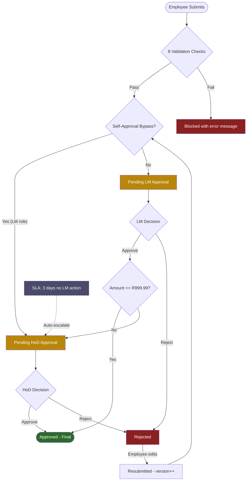

# Expense Reimbursement Manager

Zoho Creator application for governance-first expense reimbursement with South African compliance (King IV, SARS, POPIA, ESG). Built with [ForgeDS](https://github.com/HolgerRGevers/ForgeDS).

<div align="center">

**7 forms** | **13 Deluge scripts** | **44 linter rules** | **SA compliance built-in**

[](https://github.com/HolgerRGevers/expense_reimbursement_manager/raw/main/exports/Expense_Reimbursement_Management-stage.ds)

</div>

---

## Deploy to Zoho Creator

### Option A: Import the .ds file

1. Download [**Expense_Reimbursement_Management-stage.ds**](https://github.com/HolgerRGevers/expense_reimbursement_manager/raw/main/exports/Expense_Reimbursement_Management-stage.ds) -- contains all 7 forms, fields, reports, and permissions in one file
2. In Zoho Creator: **Settings > Import Application > Upload .ds file**
3. Import the seed data:

| Upload this file | Into this form | Records |
|-----------------|---------------|---------|
| [`departments.json`](config/seed-data/departments.json) | `departments` | 5 departments |
| [`clients.json`](config/seed-data/clients.json) | `clients` | 5 clients |
| [`gl_accounts.json`](config/seed-data/gl_accounts.json) | `gl_accounts` | 7 GL codes |
| [`approval_thresholds.json`](config/seed-data/approval_thresholds.json) | `approval_thresholds` | 2 tiers |
| [`compliance_config.json`](config/seed-data/compliance_config.json) | `compliance_config` | 8 config records |

4. Paste Deluge scripts from [`src/deluge/`](src/deluge/) into the corresponding form workflows, approval handlers, and scheduled tasks

> **How to import data:** Open the form > **Import Data** (top-right) > upload CSV/JSON > map columns > Import.

### Option B: Build manually

See [docs/build-guide/build-sequence.md](docs/build-guide/build-sequence.md) for the 19-step build sequence, then paste scripts from [`src/deluge/`](src/deluge/) into workflows.

### What's in the .ds file

| Component | Count | Details |
|-----------|-------|---------|
| Forms | 7 | departments, clients, gl_accounts, approval_thresholds, compliance_config, expense_claims, approval_history |
| Deluge Scripts | 13 | 6 form workflows, 6 approval handlers, 1 scheduled task (in [`src/deluge/`](src/deluge/)) |
| Approval Process | 2-level | Line Manager (up to R999.99) then Head of Department |
| Schedules | 1 | SLA enforcement daily job |

---

## Overview

A governance-first expense reimbursement system with a code-first development workflow -- edit locally, lint, deploy via `.ds` import. This project provides:

- **Zoho Creator App** -- 7 forms, 2-level approval process, and scheduled SLA enforcement for the full claim lifecycle
- **3 Linters** -- 44 static analysis rules across Deluge, Access SQL, and cross-environment validation catch errors before they reach Creator
- **Import Pipeline** -- Access-to-Zoho CSV export, data validation, and REST API uploader (mock and live modes)
- **Mock Data Generator** -- 7 personas, 175 synthetic claims to stress-test every approval pathway

## Compliance Framework

South African compliance drives every architectural decision -- field validations, approval routing, audit trail writes, and access controls.

| Principle / Standard | System Control |
|---------------------|----------------|
| **King IV P1** -- Ethical leadership | Self-approval prevention: LM submitters bypass their own tier |
| **King IV P7** -- Delegation of authority | Two-tier threshold approval (LM R999.99 / HoD R10,000) with configurable Tier_Order |
| **King IV P11** -- Risk management | Duplicate claim detection (COSO), anti-bribery classification (ISO 37001) |
| **King IV P13** -- Compliance | SARS S11(a) receipts, VAT invoice type (R5,000), POPIA consent, 5-year retention |
| **King IV P15** -- Combined assurance | Every state transition logged in Approval_History; SLA enforcement with system actor |
| **ISSB IFRS S1/S2** | GL accounts tagged with ESG_Category and Carbon_Factor for Scope 3 reporting |
| **Compliance_Config** | Org-type controls (PRIVATE, JSE_LISTED, SOE, MULTINATIONAL) with ESG, B-BBEE, carbon tracking flags |

See [docs/compliance/international-standards-mapping.md](docs/compliance/international-standards-mapping.md) for the full alignment matrix.

## Approval Flow



Every transition logged in Approval_History with actor, timestamp, and comments.

## Tooling

13 Python tools (8,197 LOC) for linting, parsing, scaffolding, and deployment:

| Tool | Purpose |
|------|---------|
| `lint_deluge.py` | 21-rule Deluge linter with `--fix` mode |
| `lint_access.py` | 8-rule Access SQL linter |
| `lint_hybrid.py` | 15-rule cross-environment linter (Access <-> Zoho) |
| `build_deluge_db.py` | SQLite DB: Deluge language data (368 rows) |
| `build_access_vba_db.py` | SQLite DB: Access/VBA language data (505 rows) |
| `parse_ds_export.py` | Extract forms, fields, and scripts from `.ds` exports |
| `scaffold_deluge.py` | Generate `.dg` boilerplate from manifest |
| `ds_editor.py` | Programmatic `.ds` modifications (5 subcommands) |
| `generate_mock_data.py` | 7-persona synthetic data generator (175 claims) |
| `validate_import_data.py` | Pre-flight CSV/JSON validator for Zoho import |
| `upload_to_creator.py` | REST API v2.1 uploader (mock mode default) |
| `export_access_csv.py` | Access `.accdb` -> CSV export (Windows) |
| `build_access_db.py` | Access `.accdb` builder with seed data |

```bash
python tools/lint_deluge.py src/deluge/           # lint all scripts
python tools/lint_deluge.py --fix src/deluge/     # auto-fix + lint
python tools/lint_hybrid.py --data exports/csv/   # cross-environment validation
```

## Project Structure

```
config/               ForgeDS configuration, seed data, email templates
src/deluge/           13 production Deluge scripts (693 LOC)
exports/              .ds snapshots (deployment source + disaster recovery)
tools/                13 Python tools (8,197 LOC)
docs/                 Architecture, compliance, build guide, import guide
enhancements/         Future roadmap: Two-Key auth, OmegaScript vision
tests/                Linter test fixtures (.dg, .sql)
```

## Requirements

- Python >= 3.10 (stdlib only, no external packages needed)
- ForgeDS (for linting and deployment)
- pyodbc + Microsoft Access Driver (Windows only, for `.accdb` operations)

## License

[MIT](LICENSE)
